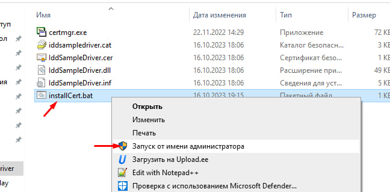
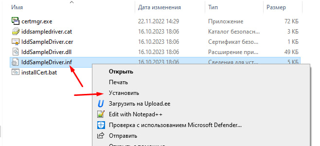

# SP_kurz

Курсовой проект по системному программированию

## Проект драйвера виртуального монитора

Проект в папке [IndirectDisplay](./IndirectDisplay). За основу взят [IndirectDisplay sample из репозитория microsoft/Windows-driver-samples](https://github.com/microsoft/Windows-driver-samples/tree/main/video/IndirectDisplay).

### Использование

Готовые к использованию файлы проекта можно найти в [релизах](https://github.com/11ALX11/SP_kurz/releases). Драйвер расчитан на **Windows 10+** (в теории с Windows 8).

Перед использованием нужно подписать и установить драйвер:

- С правами админа запустите .bat
- Файл .inf нужно установить

С помощью *IddSampleApp.exe* можно временно добавить монитор. (запуск от имени администратора).

Альтернативно, можно установить адаптер (на основе драйвера). Зайдите в **диспетчере устройств**. Кликните по любому устройству, выберите в панели меню (сверху) **Действие -> Установить старое устройство**. Дальше нас интересует **установка вручную** (но на самом деле без разницы). Дальше ищем в списке **Видеоадаптеры**. Теперь выбираем **Установить с диска** и ищем наш **.inf** драйвер.

> [!IMPORTANT]
> Если есть желание убрать виртуальный монитор после такой установки, в **диспетчере устройств -> видеоадаптеры**  ищите **IddSampleDriver Device**. **Удалите** этот фиктивный адаптер (пункт **Удалить устройство**).

## Лист задания

## Курсовой проект (документ)

[Отсутствет](./doc/kurz.docx)

## Литература

* [Драйвер — это просто / Хабр](https://habr.com/ru/articles/145926/)

* [Что такое драйвер? - Windows drivers | Microsoft Learn](https://learn.microsoft.com/ru-ru/windows-hardware/drivers/gettingstarted/what-is-a-driver-)

* [Пользовательский режим и режим ядра - Windows drivers | Microsoft Learn](https://learn.microsoft.com/ru-ru/windows-hardware/drivers/gettingstarted/user-mode-and-kernel-mode)

* [Написание первого драйвера - Windows drivers | Microsoft Learn](https://learn.microsoft.com/ru-ru/windows-hardware/drivers/gettingstarted/writing-your-first-driver)

* [Написание универсального драйвера Windows (UMDF 2) на основе шаблона - Windows drivers | Microsoft Learn](https://learn.microsoft.com/ru-ru/windows-hardware/drivers/gettingstarted/writing-a-umdf-driver-based-on-a-template)

* [Написание Hello World драйвера Windows (KMDF) - Windows drivers | Microsoft Learn](https://learn.microsoft.com/ru-ru/windows-hardware/drivers/gettingstarted/writing-a-very-small-kmdf--driver)

* [Написание универсального драйвера Windows (KMDF) на основе шаблона - Windows drivers | Microsoft Learn](https://learn.microsoft.com/ru-ru/windows-hardware/drivers/gettingstarted/writing-a-kmdf-driver-based-on-a-template)

* [Подготовка компьютера для развертывания и тестирования драйверов (WDK 10) - Windows drivers | Microsoft Learn](https://learn.microsoft.com/ru-ru/windows-hardware/drivers/gettingstarted/provision-a-target-computer-wdk-8-1)

* [Multiple-Monitor Support in the Display Driver - Windows drivers | Microsoft Learn](https://learn.microsoft.com/en-us/windows-hardware/drivers/display/multiple-monitor-support-in-the-display-driver)

* [Driver design guides for display, graphics, and compute accelerator devices - Windows drivers | Microsoft Learn](https://learn.microsoft.com/en-us/windows-hardware/drivers/display/)

* [Road map for the Windows Display Driver Model (WDDM) - Windows drivers | Microsoft Learn](https://learn.microsoft.com/en-us/windows-hardware/drivers/display/roadmap-for-developing-drivers-for-the-windows-vista-display-driver-mo)

* [Initializing Display Miniport and User-Mode Display Drivers - Windows drivers | Microsoft Learn](https://learn.microsoft.com/en-us/windows-hardware/drivers/display/initializing-display-miniport-and-user-mode-display-drivers)

* [Installing Test-Signed Driver Packages - Windows drivers | Microsoft Learn](https://learn.microsoft.com/en-us/windows-hardware/drivers/install/installing-test-signed-driver-packages)

* [Загрузка тестового подписанного кода - Windows drivers | Microsoft Learn](https://learn.microsoft.com/ru-ru/windows-hardware/drivers/install/the-testsigning-boot-configuration-option)

* [Indirect display driver model overview - Windows drivers | Microsoft Learn](https://learn.microsoft.com/en-us/windows-hardware/drivers/display/indirect-display-driver-model-overview)
